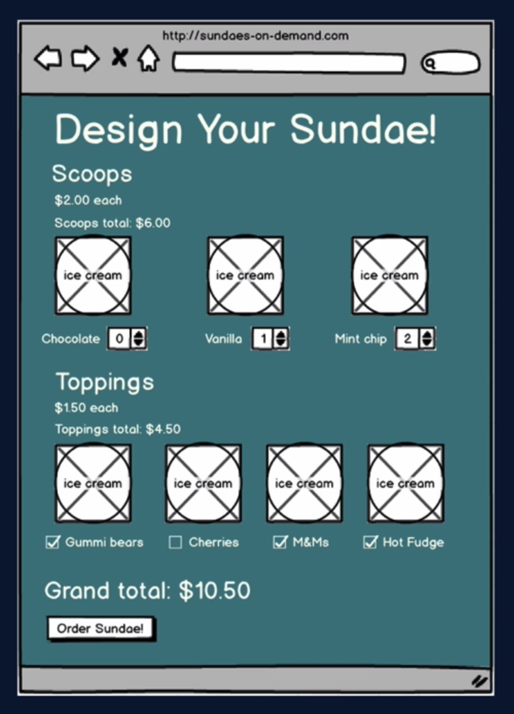

# Intro

- strong philosophy
- it is opinionated
  - encourages a certain set of practices
  - test your software the way users actually use it.
  - not internal implementation (not how your software is writen)
  - we worry about the way the software works the way it is supposed to do
- **find elements by accessibility markers, not test IDs.**
- more philosophy later

---

## Roles: React Testing Library vs JEST

### React Testing library

- Provides virtual DOM for tests

### Jest

- Tes runner that
  - Find tests
  - run tests
  - determines whether tests pass or fail

---

## Let's create the first test

- So we will run:

  ```npm
  npx create-react-app color-button
  ```

- We run `npm test` and we enter in watch mode.

- `create-react-app` comes with a pre built test that already passes, it's this:

  ```js
  import { render, screen } from '@testing-library/react';
  import App from './App';

  test('renders learn react link', () => {
    render(<App />);
    const linkElement = screen.getByText(/learn react/i);
    expect(linkElement).toBeInTheDocument();
  });
  ```

- `render`:

  - creates virtual DOM for argument JSX
  - access virtual DOM via `screen` global

- `screen.getByText()`:

  - find an element in the DOM by display text
  - `/learn react/i`:
    - regex
    - case insensitive (`i`)
    - could be the string `'Learn React'`

- `expect().toBeInTheDocument()`

  - assertion, casus test to succeed or fail

- We can update the test to make it fail:

  ```js
  import { render, screen } from '@testing-library/react';
  import App from './App';

  test('renders learn react link', () => {
    render(<App />);
    const linkElement = screen.getByText(/learn testing library/i);
    expect(linkElement).toBeInTheDocument();
  });
  ```

- And since this doesn't exist in our component the test will fail:

  - `Unable to find an element with the text: Learn we.`

---

## Assertion

- `expect(linkElement).toBeInTheDocument()`

  - `expect` argument
    - subject of the assertion
  - `.toBeInTheDocument()`
    - `matcher`
      - comes from the Jest-DOM

- More assertion examples:
- `expect(element.textContent).toBe('hello')`
- `expect(elementsArray).toHaveLength(7)`

- jest-dom:
  - comes with create-react-app
  - `.toBe()` and `.toHaveLength()` are not from jest-dom, they are very general and can be applied to any _node_ code.
  - DOM-based matchers
    - examples: `toBeVisible()` or `toBeChcked()`, more to come.

---

## Jest

- React Testing Library heps with:

  - rendering components into Virtual DOM
  - searching with vrtual DOM
  - interacting with virtual DOM

- Needs a test runner

  - that's where Jest comes in
  - find tests, run them, makes assertions

- Jest

  - is reocommended by Testing Library
  - comes with `crate-react-app`

- `npm test` runs an npm script that runs Jest in watch mode.
  - watch for changes since last commit
  - only run tests realted to these files
  - no changes? no tests
    - type `a` to run all tests

---

## TDD

- write tests before writing code
  - then we write code according to spec set by tests.
- red-green testing

  - we weant the test to fail before code is written

- Why TDD?
  - makes a huge difference in hot it feels to write tests
    - part of the coding process, not a 'chore' to do at the end
  - more efficient
    - re-run tests "for free" after changes

---

## React Testing Library Philosophy

- drives us towwards best practices

#### What does React Testing Library do?

- creates a viertual DOM for testing
  - utilities for interacting with DOM
- allows testing without a browser

- Types of Tests:
  - Unit tests
    - tests one unit of code in isolation (funciton or react component)
  - Integration tests
    - how multiple units work together
  - Functional tests (general behavior of the software)
    - tests a particular function of software
      -react testing library encourages functional (behavior) tests
  - Acceptance / end-to-end (e2e) Tests
    - use actual browser and server (cypress, selenium)

---

## Funcional testing vs Unit testing

- Unit testing
  - isolated: mock dependencies, test internals
  - ⭐️ very easy to pinpoint failures
  - 👎 further from how users interact with software
  - 👎 more likely to break with refactoring
- Functional testing

  - include all relevant units, test behavior
  - ⭐️ close to how users interact with software
  - ⭐️ Robust tests
  - 👎 more difficult to debug failing tests

- React testing libraries believes that the advantages of Functional Testing outweighs the disavantages of Unit Testing.

---

## TDD vs BDD

- testing library encourages tesing the way users actually uses the app
- so shouldnt be calling this BDD instead of TDD?
- BDD is very explicitly defined:
  - involves collaboraiton between lots of roles
    - developers, QA, businessa partners
  - defines a process for different groups to interact
- In this course, only developers, so TDD!

---

## Accessbility and finding elements with React Testing Library

- Testing Library recommends finding elements by acessbility handles (W3C)
  - [https://testing-library.com/docs/guide-which-query/](https://testing-library.com/docs/guide-which-query/)
- create-react-app's example test uses `getByTest`:

  - ok for non-interactive elements
  - better: `getByRole()` (see link above)
  - So we could rewrite it like this:

    ```js
    import { render, screen } from '@testing-library/react';
    import App from './App';

    test('renders learn react link', () => {
      render(<App />);
      const linkElement = screen.getByRole('link', { name: /learn react/i });
      expect(linkElement).toBeInTheDocument();
    });
    ```

  - Roles documentation: [https://www.w3.org/TR/wai-aria/#role_definitions](https://www.w3.org/TR/wai-aria/#role_definitions)
    - some elements have built-in roles: `button`, `a` (`link`)
  - Can't find an element like a screen reader would?
    - Then your app isn't friendly to screen readers.
  - jest-dom documentation: [https://github.com/testing-library/jest-dom](https://github.com/testing-library/jest-dom)
  - Much more about queries and roles later!

---

## General Course Plan

- Start with very simple React
  - This is so we can focus on Testing Library syntax
- **First app**: not much of an app
  - chaning button color, disabling button with checkbox
  - introduce: testing interactions that affect the DOM, unit testing funtions
- Builid up to more complex functionality and tests
- **Second App**: design and order an ice-cream sundae
  - testing more complex user interacitons, interactions between components
  - mocking server responses with _Mock Service Worker_
  - testing `async` functionality

### A note about React explanations

- Folks come to this course at many levels
- Optional lectures explaining React Syntax and descions

---

## Testing styles from imported CSS modules

- Testing Styles from Imported CSS Modules
- A common question about testing styles is "why doesn't .toHaveStyle() work with classes from my imported CSS module?"

### Mocking CSS modules

- In the case of create-react-app applications -- or applications that have otherwise mocked css modules for Jest -- CSS module imports are simply ignored for Jest test.

### Cosmetic Styles vs. Functional Styles

- In many cases, the classes are merely cosmetic and won't affect functional tests (such as placement of the element on the page). In these cases, mocking the CSS modules works fine. However, sometimes classes do affect function. For example, say you have a CSS module that uses a hidden class, which results in display: none when interpreted. Without adding a Jest transformer to interpret the CSS, Testing Library will not know that hidden class would result in display: none. Tests around element visibility that rely on this class will fail.

### Transformers

- For styles to be interpreted in tests, you need a transformer to, well, transform the CSS classes into styles. Here are a couple options:

[https://www.npmjs.com/package/jest-transform-css](https://www.npmjs.com/package/jest-transform-css)

[https://www.npmjs.com/package/jest-css-modules-transform]()https://www.npmjs.com/package/jest-css-modules-transform

- The latter has more downloads per week, but the former seems to be more actively maintained.

### Testing for Class Name

- Another possibility would be to check explicitly for the class name (hidden in this example), using toHaveClass. This would be simpler, but farther from the actual user experience (this is testing implementation details, rather than how the user sees the page). It's always a balance, and I think either this approach or transforming the CSS would be defensible.

## Unit testing functions

- Functions separente from components
  - userd by several components
  - complex logic
- Unit test if:
  - complex logic difficult to test via functional tests
  - too many edge cases

## When to use Unit Test?

- When to use Unit test?
  - `replaceCamelCaseWithSpaces()` is pretty simple
  - could be covered by functional tests on button
- For more compolicated functions, unit tests help with:
  - covering all possible edge cases
  - determining what caused functional tests to fail
- Issue with fucntional tests:
  - high-level makes them resistant to refactors
  - high-level makes them difficult to diagnose

## 02 - Second Project - Sundaes on demand

- We created the app with

  ```sh
  npx create-react-app 02-sundaes-on-demand
  ```

### App Summary

- Choose ice cream flavors and toppoings and submit order
- Flavors and toppiungs come from server
- order is sent to server

  

- Backdrop to test

  - more complex user interacitons
    - multiple form entry, moving through order phases
  - mouseover popup
    - test that element disappears from DOM
  - simulating (mock) server response
    - (very imoprtant part of functional testing, we do not want to have our server running)
  - async app updates
    - we wil learn tools with testing library where we will wait for change in the DOM before making an assertion
  - global state via context
    - why does it matter? we were told we were not supposed to test implementation details
    - we will not be testing context implementaiton, we are only intesteted in testing behavior as seen by the use
    - tests no different if we used Redux, Mobx
    - only difference is the test setup
      - we will make sure component is wrapped in context
      - ensure functionality
      - avoid errors

- 3 main pages for the app
  - Order Entry Mock-up
    
    - Shows us the scoop and topopings options are, they come from the server
    - option to add any particular number of scoops you want
    - toppings, you don't get to choose more than one
    - subtotal for each section
    - a grand total
    - a button to order the sundae
  - Order Summary page
    
    - Summary of scoops, toppings and total
    - It makes we agree to terms of condtions (popover)
    - And we can confirm the order
  - Order confirmation page
    
    - We thank the customer and give the order number
    - And we create our order
    - And we say that as per our terms and conditions we don't delivery anything

### Order phase state

- The way we are going to move through these phases is by keeping track on what order phase we are in using app-level state
- If the state is:

  - `inProgress`
    - Order Page will show
  - `review`
    - Order Summary page will show
  - `completed`
    - We will see the order confirmation page
    - button to create new order which get us back to the `inProgres` state

  

### Server

- There is a Node Express server with a rest api for this project that we cloned from the course's project repo [https://github.com/bonnie/udemy-TESTING-LIBRARY/tree/main/sundae-server](https://github.com/bonnie/udemy-TESTING-LIBRARY/tree/main/sundae-server)
- We follow the instructions in the `README.md`:
  - We cloned that and we run `npm install` and run the `start script`, it will start on port 3030
- For the flavors and the toppings it just send static info
  - In a real app this would come from a DB, in our app it comes from a file
- For order, simply generates a random order number.
- Server is not needed for functional react app testing!
  - use `mock-service-worker` to mock responses from the server
  - server for spec, **manual acceptance testing**

## screen Query Methods

### `command[All]ByQueryType`

- command

  - `get`: expect element to be in DOM
  - `query`: expect alement _not_ to be in DOM
  - `find`: expect element to appear async
    - (when we want to wait for an async update to the DOM before running our assertions)

- [All]

  - (exclude) expect only one match
  - (include) expect more than one match

- QueryType
  - what we are searching by
  - `Role` (most prefered)
  - `AltText` (images)
  - `Text` (display elements)
  - Form elements
    - `PlaceholderText`
    - `LabelText`
    - `DisplayValue`

### `screen` Query Reference

- [https://testing-library.com/docs/dom-testing-library/api-queries](https://testing-library.com/docs/dom-testing-library/api-queries)
- [https://testing-library.com/docs/react-testing-library/cheatsheet](https://testing-library.com/docs/react-testing-library/cheatsheet)
- [https://testing-library.com/docs/queries/about#priority](https://testing-library.com/docs/queries/about#priority)

## `not wrapped in act(..)` warning

- React updated element after test was finished
- Don't want to follow the advice to wrap it in `act(...)`
  - Testing Library already does this for us
  - [https://testing-library.com/docs/preact-testing-library/api/#act](https://testing-library.com/docs/preact-testing-library/api/#act)
- To remedy this error:
  - Determine what changes after the test is over (async)
  - Account for that change in our test
    - awaiting the change, and
    - asserting on it
  - More info: [https://kentcdodds.com/blog/fix-the-not-wrapped-in-act-warning](https://kentcdodds.com/blog/fix-the-not-wrapped-in-act-warning)

## Mock Service Worker

- Purpose
  - intercept network calls
  - return specified responses
- Prevents network calls during tests
- Set up test conditions using server responses

### Mock Service Worker setup

- first we must install it
  - `npm install msw`
- Create handlers
- Create test server
- Make sure test server is listening during all tests
  - reset after each test
- docs: [https://mswjs.io/docs/getting-started/mocks/rest-api](https://mswjs.io/docs/getting-started/mocks/rest-api)

### Mock Service Worker Handler

- `rest.get('http://localhost:3030/scoops', (req, res, ctx) => {})`

- Handler Type: `rest` or `graphql`
  - HTTP Method: `get`, `post`, etc
    - Full URL to mock
      - Response resolver function
        - `req`: request object
        - `res`: function to create response
        - `ctx`: utiility to build response
        - [https://mswjs.io/docs/basics/response-resolver](https://mswjs.io/docs/basics/response-resolver)

### Configure the server

- [https://mswjs.io/docs/getting-started/integrate/node](https://mswjs.io/docs/getting-started/integrate/node)

- `src/mocks/server.js`:
  ```js
  // src/mocks/server.js
  import { setupServer } from 'msw/node';
  import { handlers } from './handlers';
  // This configures a request mocking server with the given request handlers.
  export const server = setupServer(...handlers);
  ```

### Configure create-react-app so MSW intercept network requests and returns responses

- [https://mswjs.io/docs/getting-started/integrate/node#using-create-react-app](https://mswjs.io/docs/getting-started/integrate/node#using-create-react-app)
- Modify the `src/setupTests.js` tests setup file:

  ```js
  // src/setupTests.js
  import { server } from './mocks/server.js';
  // Establish API mocking before all tests.
  beforeAll(() => server.listen());
  // Reset any request handlers that we may add during the tests,
  // so they don't affect other tests.
  afterEach(() => server.resetHandlers());
  // Clean up after the tests are finished.
  afterAll(() => server.close());
  ```

## `await findBy`

- **when we are waiting for something to appear asynchronously on the page, we MUST USE `await findBy`**

## Review for Project 02 - "scoops" testing

- Mock Service Worker mimics response from server
  - create handler
  - create server
  - update `setupTests` to list for requests
- `getAllByRole`
  - seartch for more than one match to role
- `await findAllByRole`
  - for asynchronous DOM update of elements

## Server Errors: Planning

- Fill in that `catch` statement we left as TODO
- Display `AlertBanner` component if `axios` throws an error
  - instead of content from server
- Use a simple react-bootstrap alert
  - [https://react-bootstrap.netlify.app/components/alerts](https://react-bootstrap.netlify.app/components/alerts)
  - role: `alert`
- By default, handlers return non-error response
  - Override with error response for particular tests

### Jest Debugging Tools

- Jest debugging tools in this section
  - running only one test file
  - running only one test within a file
- To give us something to debug
  - Going to write code we know we won't pass

## `waitFor()`

- When in need to wait for any period of time you can `use` waitFor, to wait for your expectations to pass.

- `waitFor` may run the callback a number of times until the timeout is reached. Note that the number of calls is constrained by the timeout and interval options.

- This can be useful if you have a unit test that mocks API calls and you need to wait for your mock promises to all resolve.

- [https://testing-library.com/docs/dom-testing-library/api-async#waitfor](https://testing-library.com/docs/dom-testing-library/api-async#waitfor)

## Context

### Context file

- Kent C. Dodds pattern to set up context with embedded state
- [https://kentcdodds.com/blog/application-state-management-with-react](https://kentcdodds.com/blog/application-state-management-with-react)


- `useMemo`:
  - The React useMemo Hook returns a memoized value.
  - Think of memoization as caching a value so that it does not need to be recalculated.
  - The useMemo Hook only runs when one of its dependencies update.
  - This can improve performance.

## Wrapping globally to all rendered components:

- How to apply a wrapper (could be a Context Provider) globally to all the components we render in our tests
- [https://testing-library.com/docs/react-testing-library/setup](https://testing-library.com/docs/react-testing-library/setup)
- Setup:
  - create a file called `test-utils.js`
  - instead of importing from `'@testing-library/react'`, we are going to import from `test-utils.js` which will override the `render`

<style>
img{width: 50%; display: block; margin: 0 auto;}


</style>
